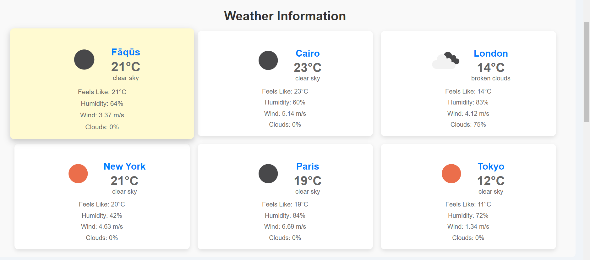
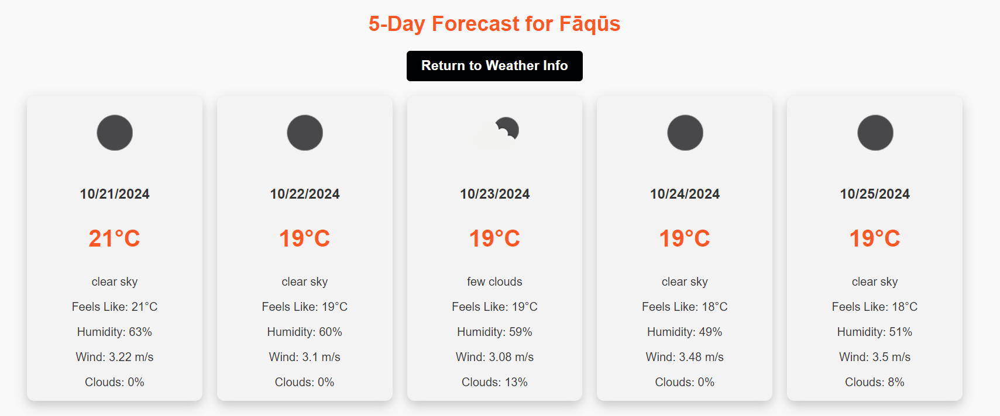
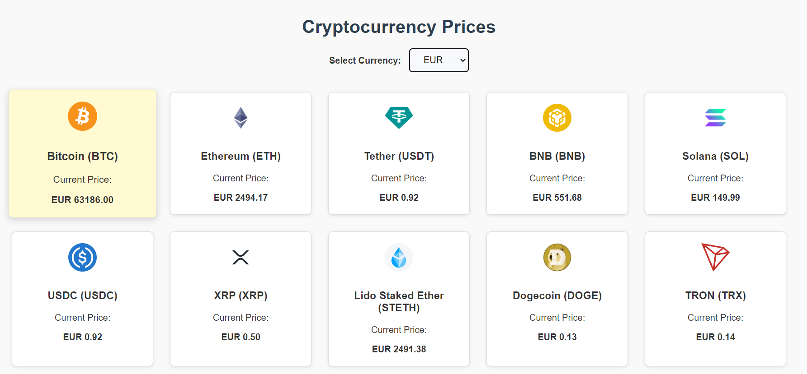
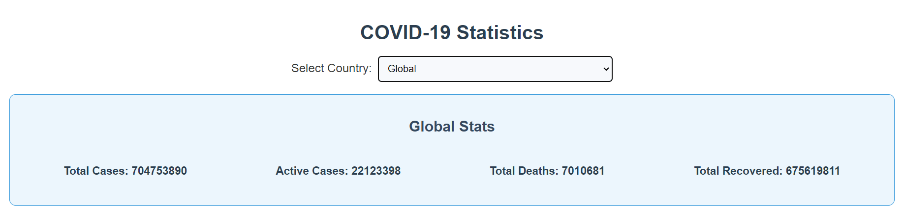
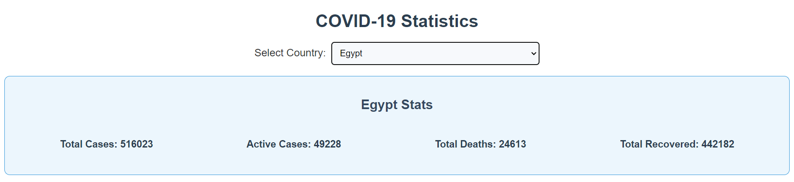

#  Wether-Crypto-Covid-obelian ai-frontend assesment 

## Deployment Link
https://react-js-obelian-aseesmnet.vercel.app/

##  Application Sections 

Application consists three main section Wether information, Crypto Currencies Prices, and Covid-19.

###  Wether information: 

A feature that provides real-time weather information for a specific location. Users can input a location, and the application retrieves and displays current weather conditions, including temperature, humidity, wind speed, and weather description.

Also, by clicking on the city you want, you can get the weather forecast for the next 5 days.

###  Crypto Currencies Prices: 

This feature enables users to track and monitor the prices of various cryptocurrencies, with the option to display the prices in their preferred currency.

###  Covid-19: 

This feature provides data on the number of confirmed cases, deaths, and recoveries related to COVID-19. Users can input a country, and the application retrieves and displays the latest COVID-19 statistics.

